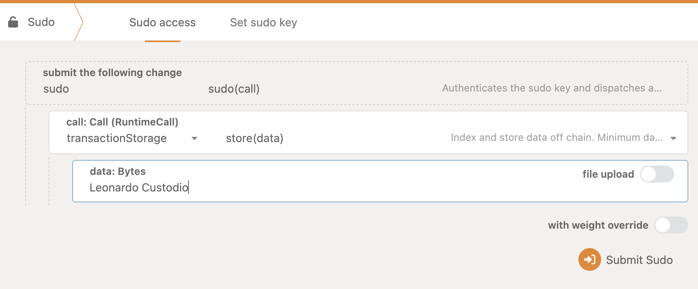

# Bulletin and IPFS - Client template

This template has a slightly modified version of [polkadot-bulletin-chain](https://github.com/paritytech/polkadot-bulletin-chain) \
We have added the `sudo` pallet back so you can interact with the chain without People Chain and the bridge.

## Running locally

### 1. Install Polkadot-SDK dependencies

Platform specific instructions can be found at: https://docs.polkadot.com/develop/parachains/install-polkadot-sdk

### 2. Setup toolchain

Make sure your Rust is updated and you have the toolchain necessary, for people running macOS:

```bash
rustup default stable
rustup update
rustup update nightly
rustup target add wasm32v1-none --toolchain nightly
rustup component add rust-src --toolchain stable-aarch64-apple-darwin
```

Other platform specific instructions can be found at https://docs.polkadot.com/infrastructure/running-a-node/setup-full-node

### 3. Install Zombienet

You can install it in multiple ways, including just downloading the binary, for the sake of simplicity let's use npm:
```bash
npm i @zombienet/cli@latest -g
```

### 4. Compile the chain and start zombienet

There is a convenience script in the root directory that you can just run:

```bash
./start.sh
```

### 5. Interacting with the chain

You can do that in multiple ways, in this example, we are using Polkadot-JS

Access the sudo pallet at: https://polkadot.js.org/apps/?rpc=ws://127.0.0.1:9944#/sudo

And store any data you want by sending the following extrinsic: `transactionStorage.store`


